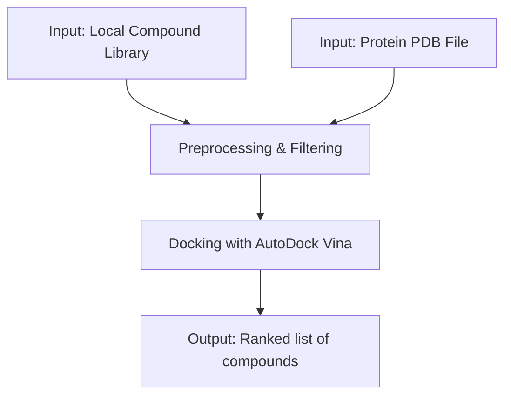
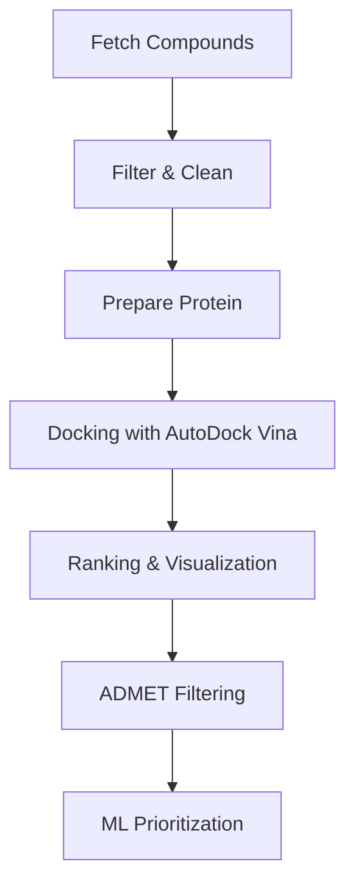

# naturaDock

[](https://github.com/cartesianpixels/naturaDock)
[](https://opensource.org/licenses/MIT)
[](https://hub.docker.com/r/cartesianpixels/naturadock)

A reproducible, command-line pipeline for **virtual screening of compound libraries against protein targets** using [AutoDock Vina](http://vina.scripps.edu/), [RDKit](https://www.rdkit.org/), and [Biopython](https://biopython.org/).

---

## 🔬 The Problem

The discovery of novel bioactive compounds is often hampered by a landscape of **fragmented, complex, and expensive computational tools**. This creates a high barrier to entry for many researchers. `naturaDock` aims to solve this by providing a **single, automated, and open-source pipeline** that is accessible, reproducible, and easy to use.

---

## ✨ Core Features (v1.0)

- **Streamlined Preprocessing:** Handles local compound libraries (SDF, MOL2, SMILES) and protein structures (PDB).
- **Automated 3D Conformer Generation:** Prepares molecules for docking.
- **Robust Docking:** Integrates the powerful and validated AutoDock Vina engine.
- **Data Filtering:** Allows for basic filtering of compounds by properties like molecular weight.
- **Reproducibility First:** Designed from the ground up to be run inside a Docker container, ensuring results are fully reproducible.

---

## ⚙️ Installation

### Option 1: Docker (Recommended)

Pull and run the pre-built Docker image:

```bash
# Pull the Docker image
docker pull cartesianpixels/naturadock:latest

# Run naturaDock with your data
docker run -v $(pwd):/workspace cartesianpixels/naturadock:latest \
    --protein /workspace/protein.pdb \
    --ligands /workspace/ligands.sdf \
    --config /workspace/config.toml
```

### Option 2: Local Installation

1. Clone the repository:
```bash
git clone https://github.com/cartesianpixels/naturaDock.git
cd naturaDock
```

2. Install dependencies:
> **Note:** It is highly recommended to use a virtual environment.

```bash
# Install project dependencies
pip install -r requirements.txt

# Install the project in editable mode to make the CLI work
pip install -e .
```

---

## 🚀 Usage (v1 Workflow)

naturaDock is run from the command line. You can provide arguments directly or use a TOML configuration file.

### Using a configuration file (recommended):

```bash
python -m naturaDock.main --config path/to/your_config.toml
```

#### Example config.toml:

```toml
protein = "path/to/protein.pdb"
ligands = "path/to/ligand_library.sdf"
output = "path/to/output_directory"

center_x = 10.0
center_y = 12.5
center_z = -5.0

size_x = 22.0
size_y = 22.0
size_z = 22.0

max_mol_weight = 450.0
max_rotatable_bonds = 8
min_logp = -4.0
max_logp = 6.0
```

### Providing arguments directly:

```bash
python -m naturaDock.main --protein path/to/protein.pdb --ligands path/to/ligand_library.sdf --output path/to/output --center_x 10 --center_y 12.5 --center_z -5
```

### Specifying the Vina Executable:

The path to the AutoDock Vina executable is determined in the following order:
1. `VINA_EXECUTABLE` environment variable.
2. `vina.exe` in the project's root directory.

---

## 📊 Workflow (v1.0)



---

## 🛠️ Roadmap (Future Features)

The V1 release is focused on creating a robust, local pipeline. Future versions will expand on this foundation with more advanced features:

### Automated Data Fetching:
```bash
python scripts/fetch_compounds.py --source pubchem --query "flavonoids"
```

### Advanced Analysis & Prioritization:
```bash
# ADMET & ML Prioritization
python scripts/run_admet.py --input docking_results.csv
python scripts/train_ml.py --input admet_results.csv
```

### Expanded Workflow:


### Web Interface
A user-friendly GUI for easier job submission and results visualization.

---

## 🧑‍💻 Contributing

naturaDock is in an early MVP stage. Contributions are welcome:

- Bug reports
- Feature requests
- New modules (e.g., descriptors, visualization, ADMET tools)
- Documentation improvements

Please open an issue or submit a pull request.

---

## 📄 License

This project is licensed under the MIT License - see the [LICENSE](LICENSE) file for details.

---

## 🔗 Links

- [AutoDock Vina](http://vina.scripps.edu/)
- [RDKit](https://www.rdkit.org/)
- [Biopython](https://biopython.org/)
- [Docker Hub](https://hub.docker.com/r/cartesianpixels/naturadock)