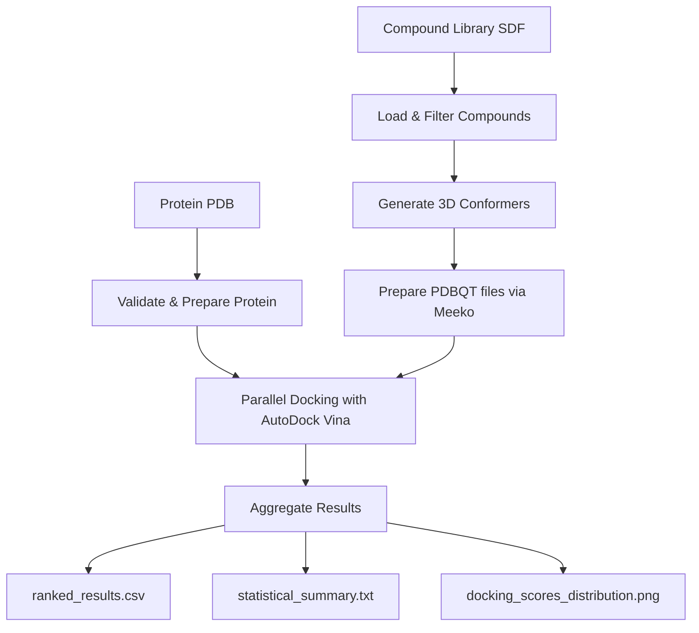

# naturaDock

[](https://opensource.org/licenses/MIT)
[](https://hub.docker.com/r/cartesianpixels/naturadock)
[](https://www.python.org/downloads/)

A reproducible, command-line pipeline for **virtual screening of compound libraries against protein targets** using [AutoDock Vina](https://github.com/ccsb-scripps/AutoDock-Vina), [RDKit](https://www.rdkit.org/), and [Biopython](https://biopython.org/).

---

## 🔬 The Problem

The discovery of novel bioactive compounds is often hampered by a landscape of **fragmented, complex, and expensive computational tools**. This creates a high barrier to entry for many researchers. `naturaDock` aims to solve this by providing a **single, automated, and open-source pipeline** that is accessible, reproducible, and easy to use.

---

## ✨ Core Features (v1.0)

- **Streamlined Preprocessing:** Handles local compound libraries (SDF, MOL2, SMILES) and protein structures (PDB).
- **Automated 3D Conformer Generation:** Prepares molecules for docking using RDKit.
- **Robust Docking:** Integrates AutoDock Vina v1.2+ via Meeko for PDBQT preparation.
- **Parallel Docking:** Multi-core support via Python's `concurrent.futures`.
- **Drug-likeness Filtering:** Filter by molecular weight, rotatable bonds, and LogP.
- **Reproducibility First:** Designed to run inside Docker — same results on any machine.

---

## ⚙️ Installation

### Option 1: Docker (Recommended)

```bash
# Pull the image
docker pull cartesianpixels/naturadock:latest

# Run with your data
docker run -v $(pwd):/workspace cartesianpixels/naturadock:latest \
    --protein /workspace/protein.pdb \
    --ligands /workspace/ligands.sdf \
    --output /workspace/output
```

> **Windows (PowerShell):** Replace `$(pwd)` with `${PWD}`.

### Option 2: Local Installation

```bash
git clone https://github.com/cartesianpixels/naturaDock.git
cd naturaDock

pip install -r requirements.txt
pip install -e .
```

> Requires Python 3.11+ and AutoDock Vina installed and on your PATH.

---

## 🚀 Usage

### Using a config file (recommended)

```bash
python -m naturaDock.main --config path/to/config.toml
```

#### Example `config.toml`:

```toml
protein = "path/to/protein.pdb"
ligands = "path/to/ligands.sdf"
output  = "path/to/output"

size_x = 22.0
size_y = 22.0
size_z = 22.0

max_mol_weight      = 500.0
max_rotatable_bonds = 10
min_logp            = -5.0
max_logp            = 6.0
```

### Using command-line arguments directly

```bash
python -m naturaDock.main \
    --protein protein.pdb \
    --ligands ligands.sdf \
    --output output/ \
    --size_x 22 --size_y 22 --size_z 22 \
    --max_mol_weight 700 \
    --max_rotatable_bonds 12
```

### All options

| Option | Default | Description |
|--------|---------|-------------|
| `--protein` | required | Path to protein PDB file |
| `--ligands` | required | Path to compound library (SDF, SMI, MOL2) |
| `--output` | required | Output directory |
| `--size_x/y/z` | 60.0 | Docking box dimensions (Å) |
| `--max_mol_weight` | 500.0 | Maximum molecular weight (Da) |
| `--max_rotatable_bonds` | 10 | Maximum rotatable bonds |
| `--min_logp` / `--max_logp` | -5.0 / 5.0 | LogP range |
| `--export_format` | csv | Results format: `csv` or `xlsx` |
| `--num_workers` | all cores | Parallel docking workers |
| `--skip_analysis` | false | Skip analysis step |

### AutoDock Vina executable

The Vina binary is resolved in this order:
1. `VINA_EXECUTABLE` environment variable
2. `vina` on the system PATH (Linux/macOS)
3. `vina.exe` in the project root (Windows)

---

## 📊 Workflow


```mermaid
flowchart TD
    A[Protein PDB] --> B[Validate & Prepare Protein]
    C[Compound Library SDF] --> D[Load & Filter Compounds]
    D --> E[Generate 3D Conformers]
    E --> F[Prepare PDBQT files via Meeko]
    B --> G[Parallel Docking with AutoDock Vina]
    F --> G
    G --> H[Aggregate Results]
    H --> I[ranked_results.csv]
    H --> J[statistical_summary.txt]
    H --> K[docking_scores_distribution.png]
```

---

## 📁 Output

```
output/
├── protein.pdbqt                       # Prepared receptor
├── prepared_compounds/                 # Prepared ligand PDBQT files
│   └── compound_name.pdbqt
├── docking_results/                    # Raw Vina output
│   └── compound_name_docked.pdbqt
├── ranked_results.csv                  # Compounds ranked by affinity (kcal/mol)
├── statistical_summary.txt             # Descriptive statistics
└── docking_scores_distribution.png     # Score distribution plot
```

---

## 🧪 Quick Test (1HSG HIV Protease)

A classic benchmark — HIV protease (1HSG) with indinavir, a known inhibitor:

```bash
# Download test data
curl -o protein.pdb "https://files.rcsb.org/download/1HSG.pdb"
curl -o ligands.sdf "https://pubchem.ncbi.nlm.nih.gov/rest/pug/compound/cid/5362440/SDF?record_type=3d"

# Run
docker run -v ${PWD}:/workspace cartesianpixels/naturadock:latest \
    --protein /workspace/protein.pdb \
    --ligands /workspace/ligands.sdf \
    --output /workspace/output \
    --max_mol_weight 700 \
    --max_rotatable_bonds 12
```

Expected best affinity: ~**-6.4 kcal/mol** for indinavir.

---

## 🛠️ Roadmap

- [ ] Automated compound fetching from PubChem / ZINC
- [ ] ADMET property prediction
- [ ] ML-based compound prioritization
- [ ] Web interface for job submission and visualization
- [ ] RMSD validation against crystal poses

---

## 🧑‍💻 Contributing

Contributions are welcome:
- Bug reports & feature requests via [GitHub Issues](https://github.com/cartesianpixels/naturaDock/issues)
- New modules (ADMET, visualization, descriptors)
- Documentation improvements

---

## 📄 License

MIT License — see [LICENSE](LICENSE) for details.

---

## 🔗 Links

- [AutoDock Vina](https://github.com/ccsb-scripps/AutoDock-Vina)
- [RDKit](https://www.rdkit.org/)
- [Biopython](https://biopython.org/)
- [Meeko](https://github.com/forlilab/Meeko)
- [Docker Hub](https://hub.docker.com/r/cartesianpixels/naturadock)