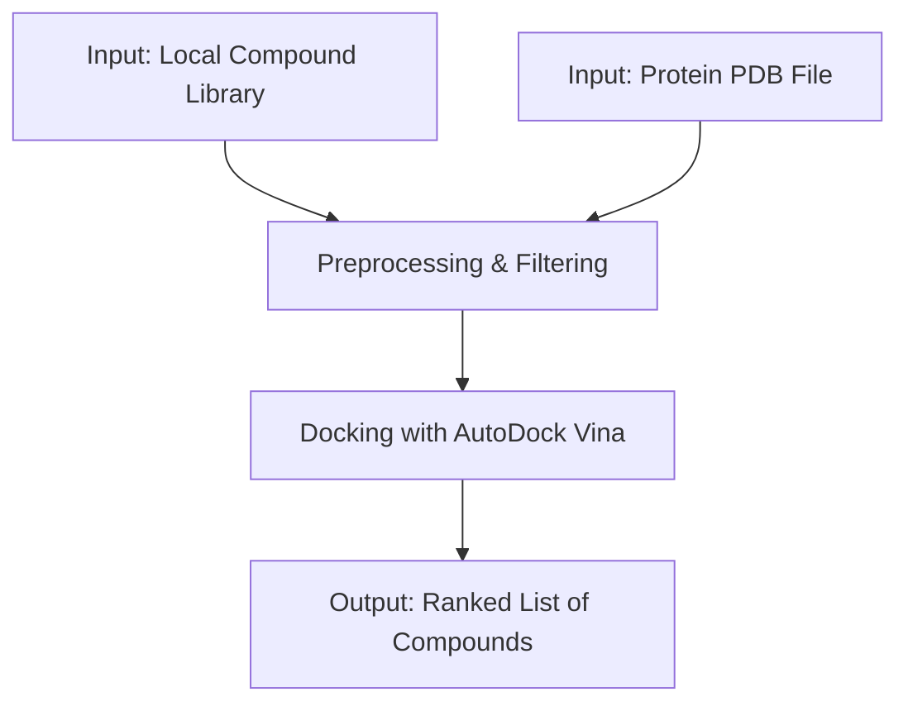
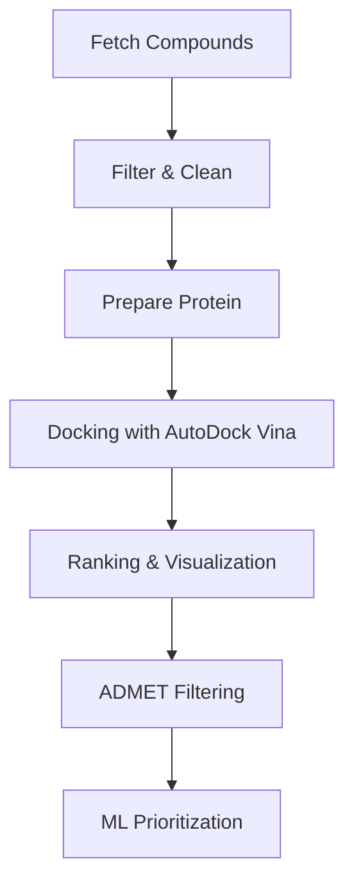

# naturaDock
[](https://github.com/cartesianpixels/naturaDock)
[](https://opensource.org/licenses/MIT)

A reproducible, command-line pipeline for **virtual screening of compound libraries against protein targets** using [AutoDock Vina](http://vina.scripps.edu/), [RDKit](https://www.rdkit.org/), and [Biopython](https://biopython.org/).

---

## 🔬 The Problem

The discovery of novel bioactive compounds is often hampered by a landscape of **fragmented, complex, and expensive computational tools**. This creates a high barrier to entry for many researchers.

`naturaDock` aims to solve this by providing a **single, automated, and open-source pipeline** that is:
- Accessible
- Reproducible
- Easy to use

---

## ✨ Core Features (v1.0)

- **Streamlined Preprocessing**: Handles local compound libraries (SDF, MOL2, SMILES) and protein structures (PDB).
- **Automated 3D Conformer Generation**: Prepares molecules for docking.
- **Robust Docking**: Integrates the validated AutoDock Vina engine.
- **Data Filtering**: Filter compounds by properties like molecular weight.
- **Reproducibility First**: Built for Docker, ensuring fully reproducible results.

---

## ⚙️ Installation

1. **Clone the repository**
   ```bash
   git clone https://github.com/cartesianpixels/naturaDock.git
   cd naturaDock
   ```

2. **Install dependencies** (recommended: use a virtual environment)
   ```bash
   # Install project dependencies
   pip install -r requirements.txt
   
   # Install the project in editable mode to enable CLI
   pip install -e .
   ```

---

## 🚀 Usage (v1 Workflow)

naturaDock is run from the command line. The entry point accepts:
- A protein file
- A directory of ligands
- A configuration file defining the binding site

```bash
# Example command (under development)
python -m naturaDock.main \
    --protein path/to/protein.pdb \
    --ligands path/to/ligand_library.sdf \
    --config path/to/config.toml
```

---

## 📊 Workflow (v1.0)



---

## 🛠️ Roadmap (Future Features)

The v1 release focuses on a robust local pipeline. Future versions will expand with advanced features:

**Automated Data Fetching**
```bash
python scripts/fetch_compounds.py --source pubchem --query "flavonoids"
```

**Advanced Analysis & Prioritization**
```bash
# ADMET & ML Prioritization
python scripts/run_admet.py --input docking_results.csv
python scripts/train_ml.py --input admet_results.csv
```

**Expanded Workflow**


- **Web Interface**: GUI for easier job submission & visualization.

---

## 🤝 Contributing

naturaDock is in an early MVP stage. Contributions are welcome:
- Bug reports
- Feature requests
- New modules (descriptors, visualization, ADMET tools)
- Documentation improvements

Please open an issue or submit a pull request.

---

## 📜 License

MIT License © 2025 Abdellah Chaaibi